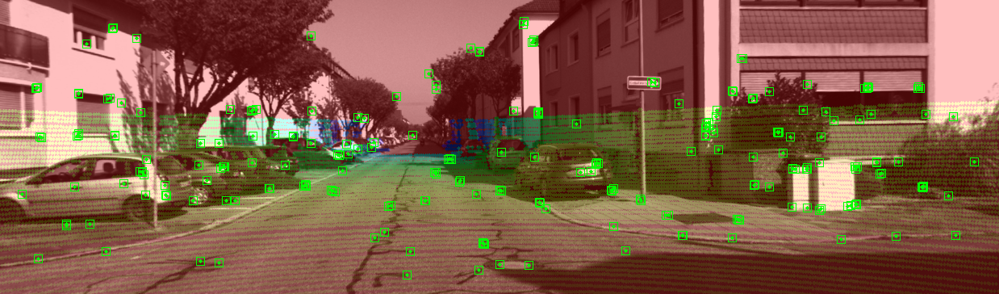

# ORB-SLAM3-RGBL

[](https://www.linux.org/)
[](https://en.cppreference.com/w/cpp/14)
[](https://www.docker.com/)
[](https://docs.ros.org/en/galactic/index.html)

This repository is a fork from [ORB-SLAM3](https://github.com/UZ-SLAMLab/ORB_SLAM3).

In this work, we add the RGB-L (LiDAR) mode to the well-known ORB-SLAM3.
This allows to directly integrate LiDAR depth measurements in the visual SLAM.
By doing this, we get precision close to Stereo mode with greatly reduced computation times.



## Build

**We suggest using Docker to run the code!**

If you want to build the code locally, please refer to the Dockerfile for installation instructions.

To build the docker image, simply run from main directory:

 ``` bash
 sudo ./scripts/docker_build.sh
 ```

Some examples for Mono camera mode and some of the example datasets have been removed to increase the clarity. These can be copied from the original repository and added to the [CMakeLists.txt](CMakeLists.txt) file.

Following modes can be directly used:

- RGB-L to fuse camera and LiDAR data
- RGB-D to use offline generated depth maps
- Stereo to use stereo images

## Data

Exemplary KITTI folder structure (where path in [docker_run.sh](scripts/docker_run.sh) points to):

```files
KITTI Odometry dataset --> Docker mounting point
└───poses/
│   │   00.txt
│   │   01.txt
│   │   ...txt
│
└───sequences
│   └───00/
|   |       calib.txt
|   |       times.txt
|   |       image_0/
|   |       image_1/
|   |       image_2/
|   |       image_3/
|   |       velodyne/
│   └───01/
|   |       ...
│   └───02/
|   |       ...
└───└───../
```

Add your path to the [KITTI Odometry dataset](https://www.cvlibs.net/datasets/kitti/eval_odometry.php) in the following files:
[scripts/docker_run.sh](scripts/docker_run.sh#L11) and [scripts/docker_run_dev.sh](scripts/docker_run_dev.sh#L11).
(Replace "/LocalStorage/KITTI_odometry/dataset/" with your local path.)

## Run the SLAM

To start the Docker container, run

``` bash
sudo ./scripts/docker_run.sh
```

or

``` bash
sudo ./scripts/docker_run_dev.sh
```

to run a container with the mounted code instead of the copied code. This allows to change the code or config files from your local machine and directly running or rebuilding within the container. No need to rebuild the Dockerfile.
\

Inside the container, change to the ORB SLAM3 directory:

``` bash
cd ORBSLAM3
```

To run the different modes with the KITTI Odometry dataset, use the following bash scripts inside the container:

``` bash
./scripts/kitti_rgbl.sh
```

``` bash
./scripts/kitti_rgbd.sh
```

``` bash
./scripts/kitti_stereo.sh
```

In the scripts, select the sequence you want to evaluate. \
To set parameters for the modes, check out the configuration files for the corresponding sequences: e.g. [Examples/RGB-L/KITTIIxx-xx.yaml](Examples/RGB-L/KITTI00-02.yaml)
Set the correct config file in [kitti_rgbl.sh](scripts/kitti_rgbl.sh).
Once the code launched, you should see two windows opening up: visualization of the camera images (in RGB-L mode with LiDAR depth) and the feature map building up.

## Generating Depth Maps for RGB-D

Existing open-source networks such as [PEnet, Enet](https://github.com/JUGGHM/PENet_ICRA2021), or MSG_CHNet can be used to generate depth maps.

In the [tools](tools/) directory, we provide a Python script to transform the Velodyne pointclouds (.bin) to depth images: [proj_velo2cam_kitti_odom.py](tools/proj_velo2cam_kitti_odom.py). These can be used to evaluate neural networks. Note that the image resolutions might have to be adjusted in the RGB-D config files.

``` bash
python3 proj_velo2cam_kitti_odom.py
```

Adjust the script to your needs by setting the correct path- and file names.

The ROS2 node [kitti_publisher](ros2/depth_map_creator/src/kitti_publisher.cpp) in the [depth_map_creator](ros2/depth_map_creator/) package can be used to generate depth maps. The correct publicFrame for the corresponding upsampling method has to be selected. Use this command to build the node:

``` bash
source /opt/ros/galactic/setup.bash
colcon build --packages-select depth_map_creator
source install/setup.bash
```

Example start of the node:

``` bash
ros2 run depth_map_creator kittipublisher --ros-args -p PublishFrequency:=10.0 -p SaveDenseDepth:=true -p CreateOverlay:=true -p SequencePath:=/kitti/sequences/00/ << Path to Dataset >>/dataset/sequences/00/
```

Upsamled depth images will be saved under /path/to/dataset/sequences/00/image_0_Depth and image_0_Depth_Overlay.

## References

If you use this repository for any academic work, please cite our original paper:

"RGB-L: Enhancing Indirect Visual SLAM using LiDAR-based Dense Depth Maps" \
Florian Sauerbeck, Benjamin Obermeier, Martin Rudolph, and Johannes Betz 

[Link to paper]( https://doi.org/10.1109/ICCCR56747.2023.10194045) \
[Link to preprint]( https://arxiv.org/abs/2212.02085)


``` bib
@INPROCEEDINGS{sauerbeck2022rgb,
  author={Sauerbeck, Florian and Obermeier, Benjamin and Rudolph, Martin and Betz, Johannes},
  booktitle={2023 3rd International Conference on Computer, Control and Robotics (ICCCR)}, 
  title={RGB-L: Enhancing Indirect Visual SLAM Using LiDAR-Based Dense Depth Maps}, 
  year={2023},
  pages={95-100},
  doi={https://doi.org/10.1109/ICCCR56747.2023.10194045},
}
```